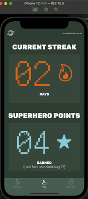
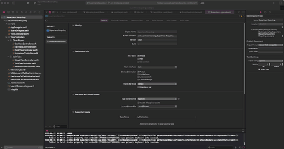
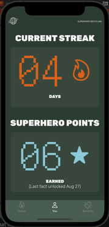
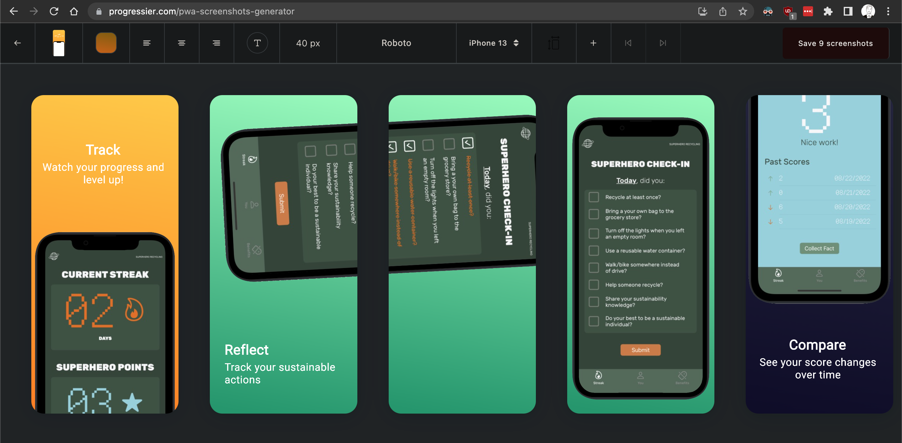
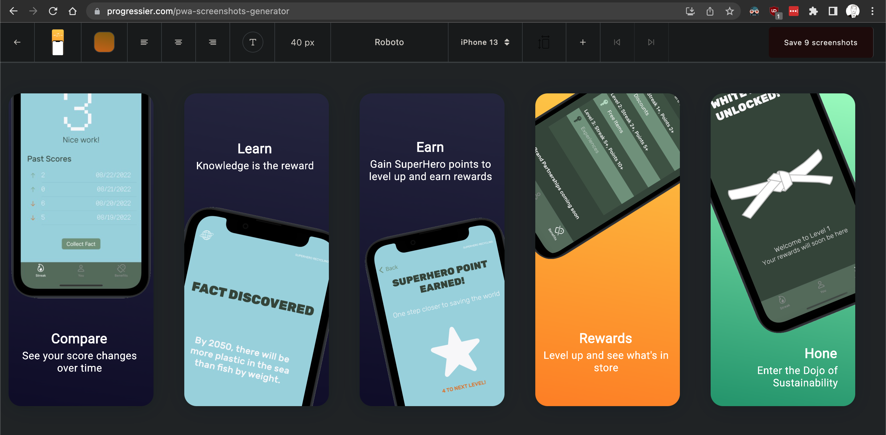
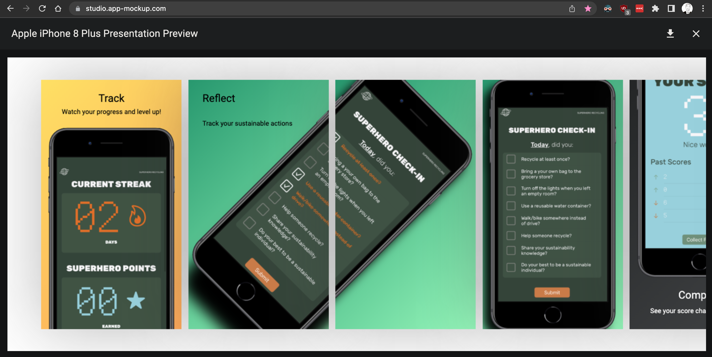
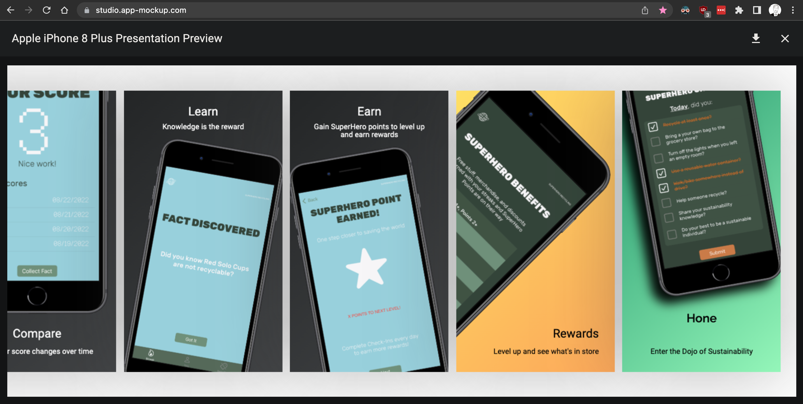
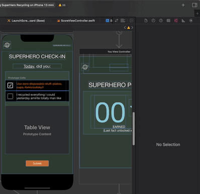

# SuperHero Recycling App

A proof-of-concept / minimum viable product for a daily engagement app incorporating edTech elements and real-world rewards to motivate users to live sustainably

A chunk of intellectual property to support the circularity brand [SuperHero Recycling](https://superherorecycling.com/help).

# App Demo

App Demo 8/26/2022 (v0.030)

This project was created with [Xcode 13](https://developer.apple.com/documentation/xcode-release-notes/xcode-13-release-notes). Download it [here](https://developer.apple.com/xcode/resources/)

## Installation Instructions

Set up git ([tutorial here](https://bytes.usc.edu/cs104/labs/lab0-github/)) and clone the repo, then open it in Xcode. 

With the project opened in Xcode, you can build the project by choosing a built-in simulator and pressing "run" or Command+R: 

## Testing (GOD MODE page easter egg)

You can get to the GOD MODE page with testing buttons (Changing streak values, knowledge points, setting up simulated score submissions, etc) by pressing an invisible button on the Benefits page 7 times in a row, just at the crown of the logo.

## Learn More

Prototyping process involved iterating on the product features depending on user behavior and the value they personally placed on the proposed discount rewards offered by the app. Users in the target demographic (USC students) were contacted and provided with an app MVP prototype, and asked to complete the sustainability game every day for a specific number of days. Developer would simply Venmo those users the cash value the user evaluated for their respective reward. Tracking user behavior in actually filling it out helped guide the app's streak requirements and rewards.

# Developer Orientation

If you have questions about stuff from the video, don't hesitate to give me a call - you've got my number.

## Intellectual Property

Developed by First Draft Games LLC - Charlie Feuerborn  

Source code owned by SH Recycling Corp.  

All Rights Reserved  
